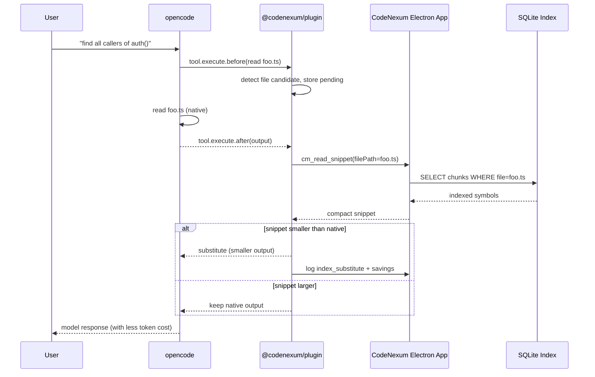
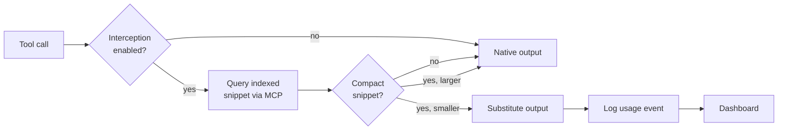
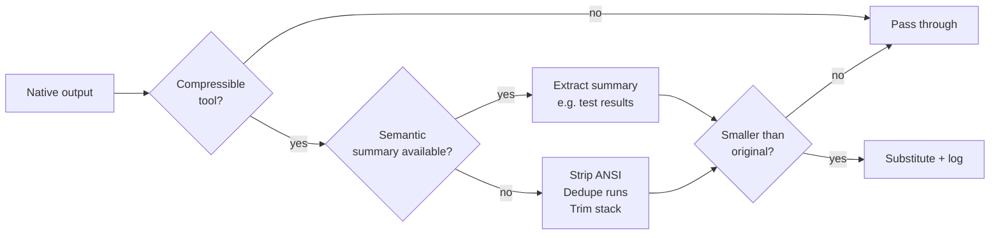
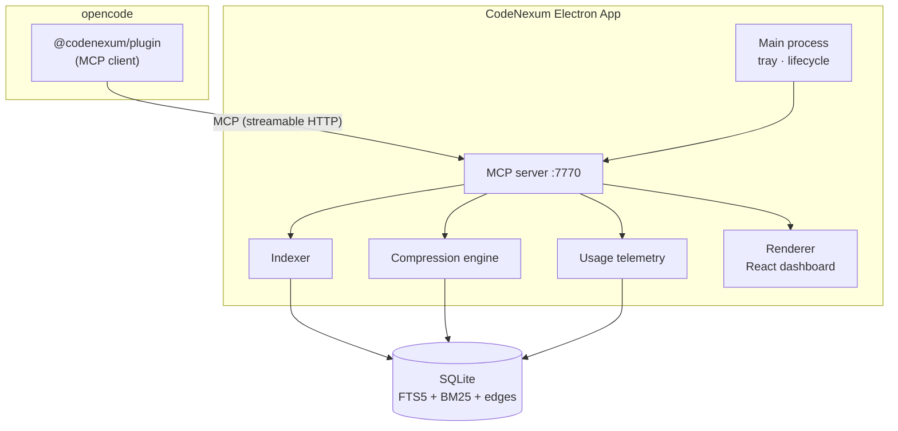
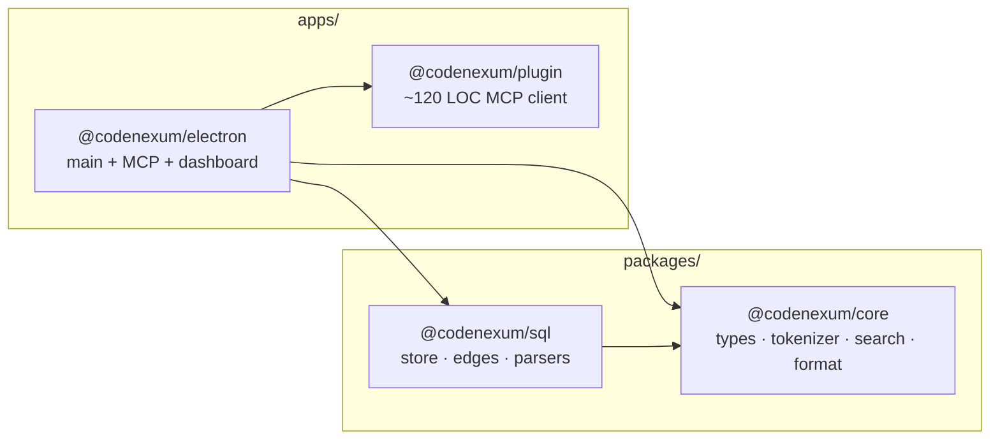
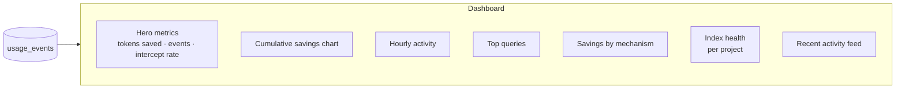
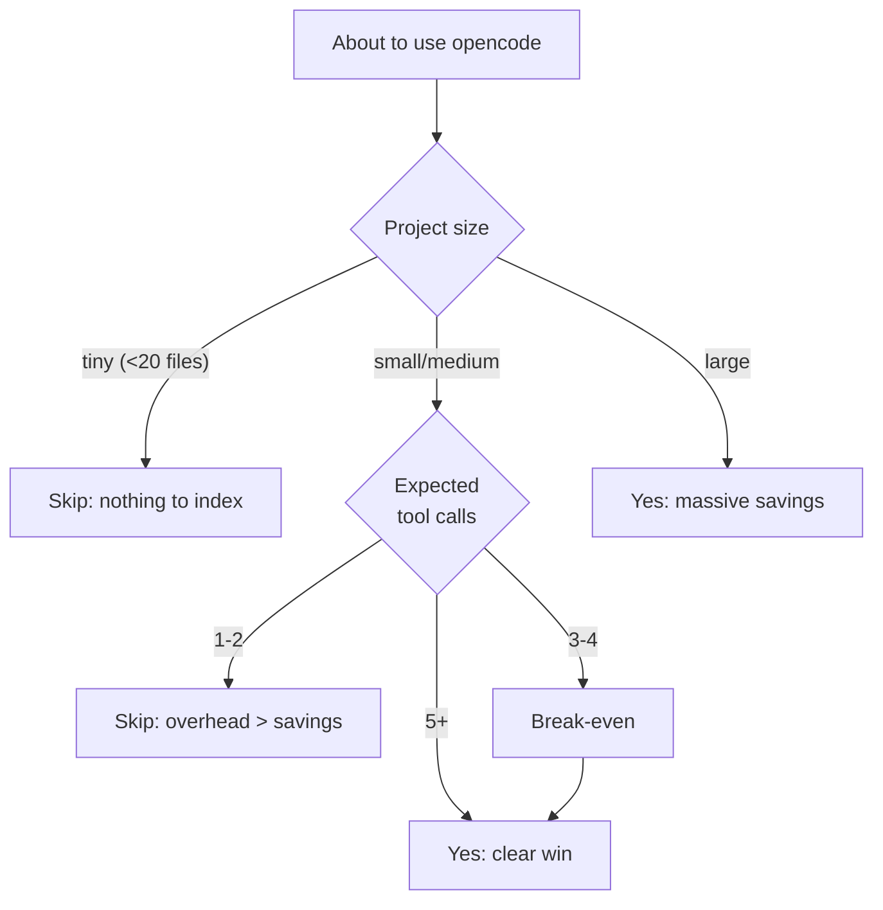

<div align="center">


# CodeNexum

### Your model knows a lot. Your context doesn't.

**CodeNexum** is a code indexer + context compression engine for [opencode](https://opencode.ai).
It dramatically cuts the tokens you spend on `read`, `grep`, `glob` and `bash` — without losing a shred of
accuracy — and gives you a useful context window, not a dumpster of logs.

> _"It's not that your model has a small context. It's that you're filling it with straw."_

</div>

---

## Why CodeNexum?

When you ask an agent to explore a repo, this happens:

- `read` returns the whole file even when you only need one function.
- `grep` dumps 4,000 lines, `node_modules` included.
- `bash npm test` throws the full 800-line log at you when all you wanted was "did it pass?".

That's **tens of thousands of tokens burned per turn**. CodeNexum intercepts that noise and replaces it with
something your model can actually use: **indexed chunks, semantic summaries, and real-time metrics**.

### The result

- **Fewer tokens spent, more useful conversation** — 40% to 80% tool output savings on mid-size projects.
- **Faster responses** — the model gets less garbage to process per turn.
- **Zero workflow change** — the plugin hooks into `tool.execute.before/after`; you keep using opencode normally.
- **Full visibility** — a live dashboard shows exactly what you saved, where, and why.

---

## Features

| | Feature | Why you care |
|---|---|---|
| 🔥 | **Incremental FTS5 + BM25 index** | Local SQLite, sub-millisecond search. Your code becomes searchable, not just readable. |
| 🧠 | **Semantic summaries** | `npm test` with 800 lines → 1 line: `8 passed, 3 failed`. The model learns only what it needs. |
| ✂️ | **ANSI / dedupe / stack-trim compression** | Strip colors, collapse repeated lines, trim indentation. Details that cost tokens and add nothing. |
| 🧩 | **`read` → indexed chunks** | Read the file, return only indexed symbols (functions, classes, exports). Keep context, skip the whole file. |
| 🔍 | **Indexed `grep` and `glob`** | Search the real indexed code, not your noisy filesystem. |
| 🔗 | **Callers / callees / impact** | Ask "who uses this function?" and get the list instantly, no manual navigation. |
| 💾 | **In-memory + on-disk cache** | Repeated `read`/`grep` cost nothing. Persists across sessions. |
| 📊 | **Live React dashboard** | Tokens saved, top queries, hot files, index health, all in real time. |
| 🪶 | **Thin plugin (~120 LOC)** | No business logic in the plugin. All indexing lives in the app — the plugin is just a proxy. |
| 🖥️ | **Cross-platform** | macOS, Windows, Linux. Tray app with auto-start. |

---

## How it works



The interception loop runs on every `read`, `bash` (cat/head/tail), `grep`, and `glob`. If the indexed
snippet is smaller than the native output, the plugin substitutes it before the model sees it. Savings
are logged for the dashboard.



For non-interceptable outputs (`bash`, `npm test`, etc.) the compression pipeline kicks in:



---

## Quick start

### 1. Install the app

Download the installer for your platform from **Releases** or build it:

```bash
git clone https://github.com/madkoding/codenexum.git
cd codenexum
bun install
bun run --filter @codenexum/electron package
```

| Platform | Artifact |
|---|---|
| macOS (Apple Silicon) | `CodeNexum-0.99.0-arm64.dmg` |
| Windows | `CodeNexum 0.99.0.exe` (portable) |
| Linux | `CodeNexum-0.99.0.AppImage` |

Open the app — it runs in the background with a tray icon.

### 2. Register the plugin

Add to your `opencode.json`:

```json
{
  "plugins": ["@codenexum/plugin"]
}
```

Restart opencode. **That's it.** The next time your agent reads a file, CodeNexum does its thing.

### 3. Watch the dashboard

Open the CodeNexum window or trigger `context_dashboard` from your agent to see cumulative savings,
top queries, and index health.

---

## Architecture





Stack: **strict TypeScript**, **Electron 43**, **React 19**, **Tailwind**, **node:sqlite**, **recharts**.

---

## Tools registered

| Tool | What it does |
|---|---|
| `context_search` | Full-text search (FTS5 + BM25) over the index |
| `context_related` | Callers, callees, imports, extends, implements of a symbol |
| `context_impact` | Files that depend on the given files |
| `context_stats` | Index stats: chunks, fill %, estimated savings |
| `context_analyze` | Re-index a project or path |
| `context_read_snippet` | Indexed snippet instead of full `read` |
| `context_search_snippet` | Search snippet to replace `grep`/`glob` |
| `context_compression` | Compressor diagnostics |
| `context_dashboard` | Dashboard state as JSON |

---

## The dashboard



Open the app and see in real time:

- **Tokens saved** — cumulative + by mechanism (substitution, snippets, compression, cache).
- **Top queries** — what your agent searches most.
- **Hot files** — what code gets read the most.
- **Index health** — per project, with freshness, coverage, failures.
- **Recent activity** — feed of every interception.

No more flying blind. You see exactly where tokens go (and where they get saved).

---

## When is it worth it?



> **Rule of thumb:** break-even at 3–4 tool calls. Everything beyond is net gain.

| Situation | Worth it? |
|---|---|
| Long session, 20+ tool calls on a large codebase | **Yes, brutal** |
| Mid-size project, agent's first exploration | **Yes** |
| Debugging tests / builds with huge logs | **Yes, huge** (semantic compression) |
| One quick question, no tools | No (plugin overhead > savings) |
| Tiny project (<20 files) | No (nothing to index) |

---

## Configuration

See [CONFIG.md](./CONFIG.md) for all environment variables (`CODENEXUM_*`).

The most useful ones:

- `CODENEXUM_MCP_PORT` (7770) — MCP server port
- `CODENEXUM_MCP_URL` — override the MCP endpoint
- `CODENEXUM_MAX_FILES` (10000) — max files indexed per project
- `CODENEXUM_MAX_FILE_BYTES` (1MiB) — max file size to index
- `CODENEXUM_SEMANTIC_COMPRESS` (1) — enable semantic summaries

---

## Uninstall

Remove `"@codenexum/plugin"` from your `opencode.json` and restart. For a full cleanup:

```bash
rm -rf ~/.config/codenexum
rm -rf ~/.config/opencode/plugins/node_modules/@codenexum
```

---

## License

MIT.

---

<div align="center">

**Built to let your agent go further with less.**

[Report a bug](https://github.com/madkoding/codenexum/issues) ·
[Request a feature](https://github.com/madkoding/codenexum/issues) ·
[See releases](https://github.com/madkoding/codenexum/releases)

</div>
